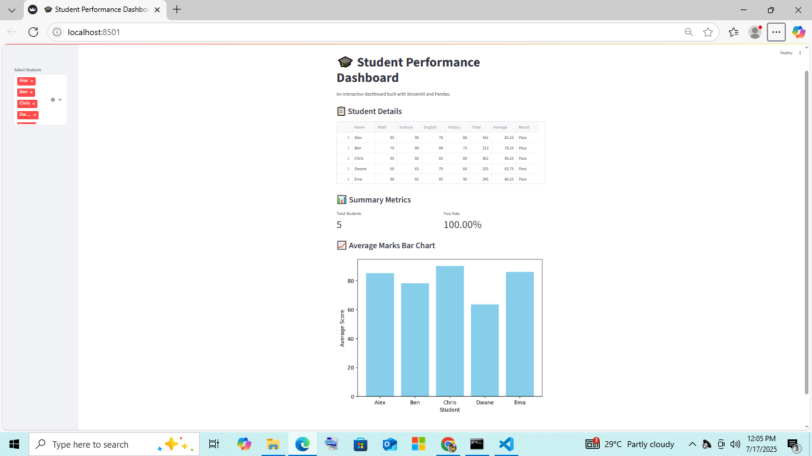

# 🎓 Student Performance Dashboard (Streamlit App)

An interactive web app built using **Python**, **Pandas**, and **Streamlit** to analyze and visualize student marks. 📊  
Ideal for teachers, schools, or anyone learning data analysis.

 

---

## 🚀 Live Demo

👉 **Try it online** (hosted on Streamlit Cloud):  
[🔗 your-link-here](https://projectpandaapp-fgskdunnjayqypv7fpvzro.streamlit.app/)

---

## 📦 Features

- 📥 Upload your own student marks CSV file
- 📊 Automatically calculates **Total**, **Average**, and **Pass/Fail**
- 📋 Sorts and displays all student scores
- 📈 Shows a bar chart of student performance
- 🎯 Filter students by name (Sidebar)

---

## 🛠️ Tech Stack

- [Python](https://python.org/)
- [Pandas](https://pandas.pydata.org/)
- [Streamlit](https://streamlit.io/)
- [Matplotlib](https://matplotlib.org/) 

---

## 🧪 Sample Dataset (`marks.csv`)

```csv
Name,Math,Science,English,History
Alex,85,90,78,88
Ben,70,80,88,75
Chris,95,85,92,89
Dwane,60,65,70,60
Ema,88,82,85,90


